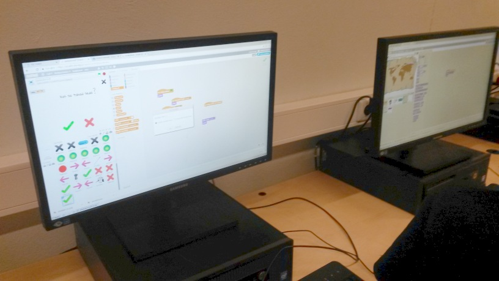

[<< Avaleht](/)

# 21. detsember 

## Scratch + Makeblock

Seekord oli kohal ainult 6 õpilast (Jõulud?). Mõned jätkasid [Scratch-iga](https://scratch.mit.edu/), mõned ehitasid roboteid.

<iframe width="560" height="315" src="https://www.youtube.com/embed/4GQSeFij_yc" frameborder="0" gesture="media" allow="encrypted-media" allowfullscreen></iframe>

